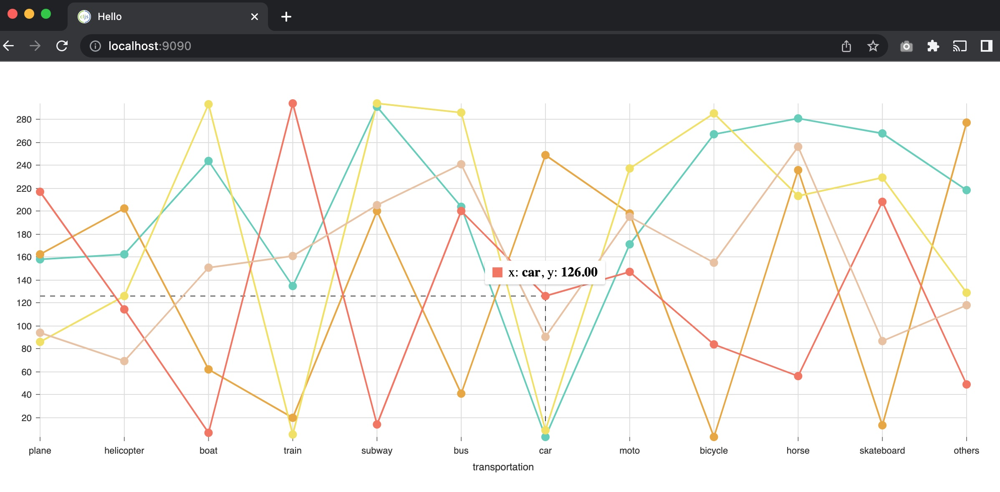
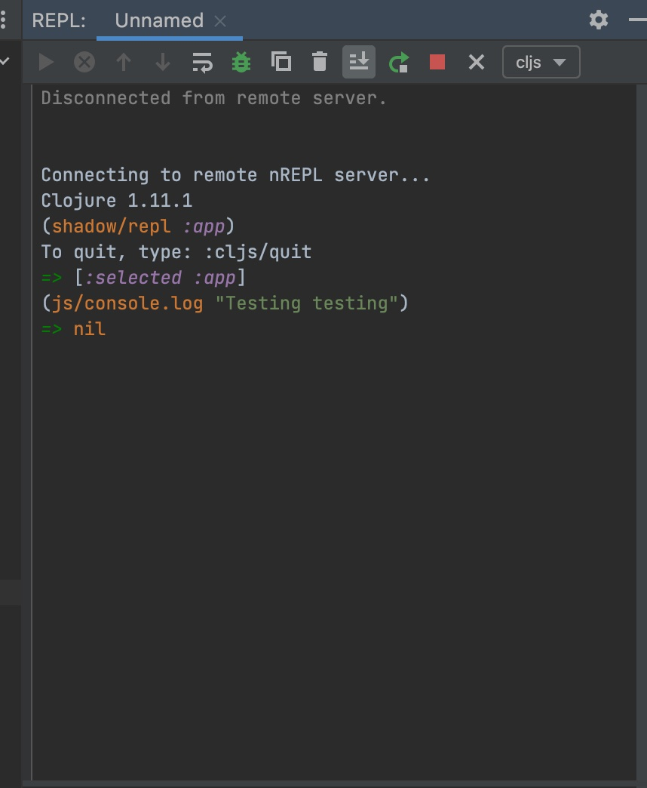

## Minimum example of rendering @nivo/line with shadow-cljs.

Start it up.

```
$ npx shadow-cljs watch app
shadow-cljs - config: /Users/jeffreysimon/projects/nivoline-example/shadow-cljs.edn
shadow-cljs - HTTP server available at http://localhost:9090
shadow-cljs - server version: 2.20.20 running at http://localhost:9630
shadow-cljs - nREPL server started on port 62643
shadow-cljs - watching build :app
[:app] Configuring build.
[:app] Compiling ...
```

Browse to http://localhost:9090 and you should see something that looks like this...



For Cursive users, create remote nREPL Configuration for the specified port, 62643, in this case.

Connect to the CLJS repl using shadow-cljs:


